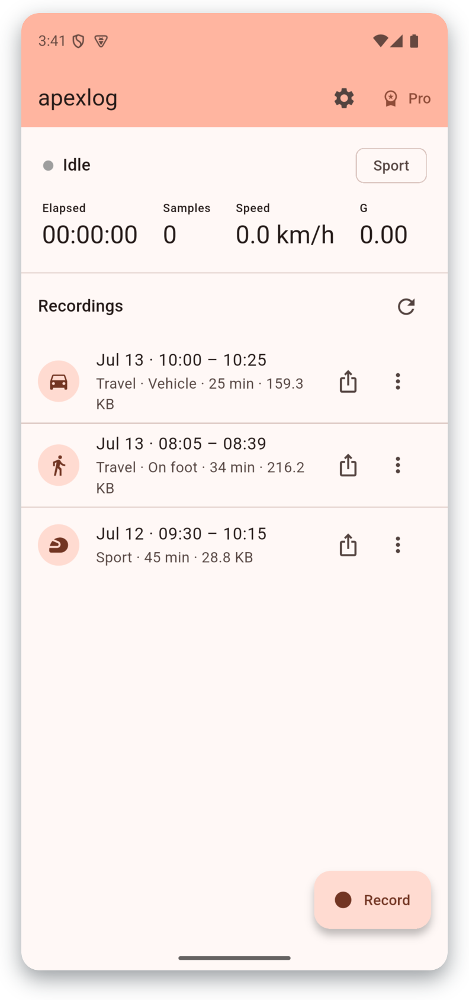
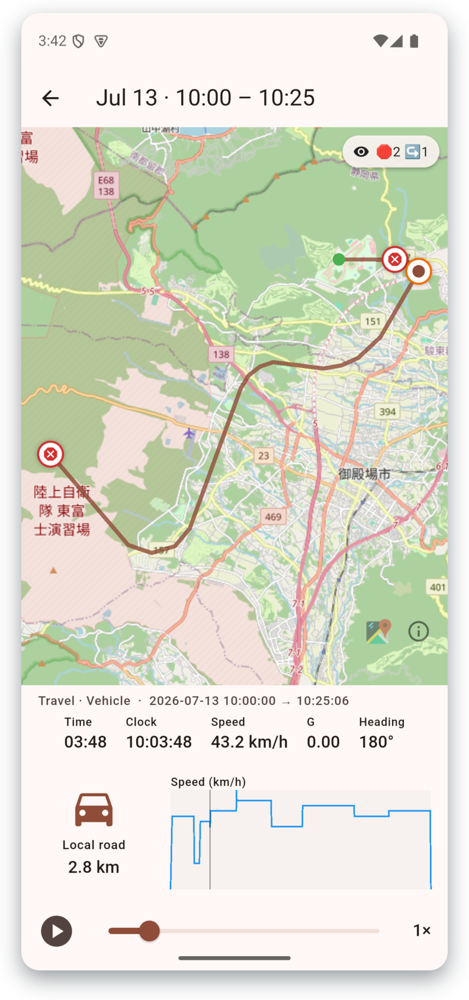
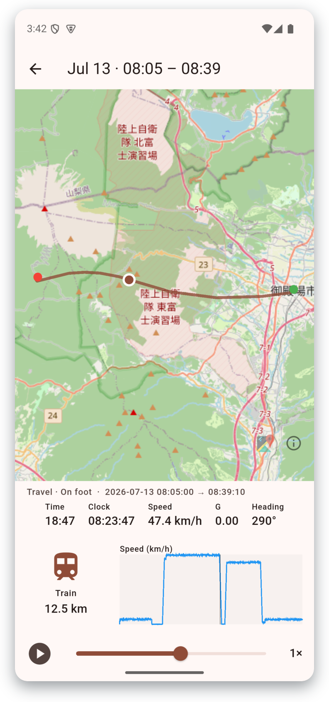
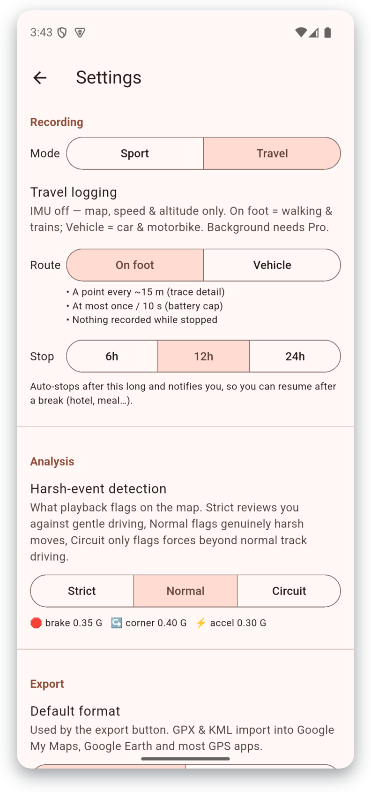

  
  <h1>走りを、そのまま再生。</h1>
  
スマホが車両テレメトリロガーに。GPS＋モーションを記録して、地図の上でG・リーン・急操作まで走りを丸ごと振り返れます。

  <a class="btn dark" href="https://apps.apple.com/app/id6781912718">App Store</a>
  <a class="btn light" href="https://play.google.com/store/apps/details?id=io.apexlog.apexlog">Google Play</a>
  
基本無料 · Pro は買い切り ¥1,000 · サブスクなし・アカウント不要・クラウドなし

## 画面を見る

  

    
    <h3>セッションが一目でわかる</h3>
    
スポーツ走行も、ドライブも、旅も一つのリストに。日時・所要時間・記録モードで並び、ファイル名は出てきません。

  

  

    NEW in 1.0.2
    
    <h3>急ブレーキ・急ハンドルを地図に</h3>
    
急ブレーキ🛑・急ハンドル↪・急発進⚡を走行軌跡の上にプロット。マーカーをタップするとその瞬間へジャンプ。感度は Strict / Normal / Circuit の3段階。

  

  

    
    <h3>旅モード</h3>
    
徒歩・電車・車の旅を省電力で丸一日記録。再生では速度に合わせてアクティビティアイコンとトリップメーターが動きます。

  

  

    
    <h3>好みに合わせて調整</h3>
    
電池優先のセンサーレート、オートストップ付き旅プリセット、解析しきい値（安全運転チェック〜サーキット）まで自由自在。

  

## できること

**記録**
- GPS 軌跡＋最大 100&nbsp;Hz の IMU（加速度・ジャイロ）を、シンプルでオープンな NDJSON ファイルに保存。センサーレートは電池節約のため調整可能。
- **旅モード：** 数メートルごとに 1 点だけ記録。セッション単位でなく、旅の 1 日を丸ごとログに。
- **バックグラウンド録画（Pro）：** 画面を消しても、ナビアプリを前面にしても録画を継続。ナビが画面を占有するバイクのための機能です。

**再生・解析**
- OpenStreetMap の地図上に走行軌跡を描画、シークバーで自由に再生。
- **G-G ダイアグラム**（フリクションサークル）、切替式の**車両ゲージ**（トップダウン／リーン／ピッチ）、旅ログには**ジャーニーゲージ**。
- **急操作の検出：** 急ブレーキ・急ハンドル・急発進を地図上のマーカーで表示、タップでその瞬間へ。

**データは自分のもの**
- オープンな **NDJSON** 形式 — [データフォーマット仕様](manual.ja#data-format-reference)を公開。自分で解析できます。
- **GPX / KML エクスポート（Pro）：** Google マイマップ・Google Earth・Strava などでルートを表示。
- アカウント・クラウド・解析・トラッキングなし。

## ニュース

  
2026-07
<b>v1.0.2 テスト中</b> — 急操作マーカー（感度3段階）、見やすくなったセッション一覧、開始・終了時刻の表示。まもなくストアへ。

  
2026-07
<b>v1.0.1 公開</b> — 旅モード（徒歩／乗り物）、GPX/KML エクスポート、センサーレート調整。

  
2026-06
<b>v1.0.0 リリース</b> — App Store・Google Play で公開。記録・再生・G-G ダイアグラム・車両姿勢。

## 無料 と Pro

| | 無料 | Pro（買い切り） |
|---|---|---|
| 録画（Sport・旅モード） | 前面のみ | **＋ バックグラウンド** |
| ログ保有 | 直近3本 | **＋ 無制限** |
| 地図／G-G／姿勢／ジャーニー／急操作の再生 | ✓ フル | ✓ フル |
| 生データ共有・GPX/KML エクスポート | — | **✓** |

**Pro は買い切り — ¥1,000。サブスクなし。**

## 入手

<a class="btn dark" href="https://apps.apple.com/app/id6781912718">App Store でダウンロード</a>
<a class="btn dark" href="https://play.google.com/store/apps/details?id=io.apexlog.apexlog">Google Play で入手</a>

- **[使い方マニュアル＆データ形式 →](manual.ja)**
- [プライバシーポリシー](privacy-policy.ja) · [English](privacy-policy)
